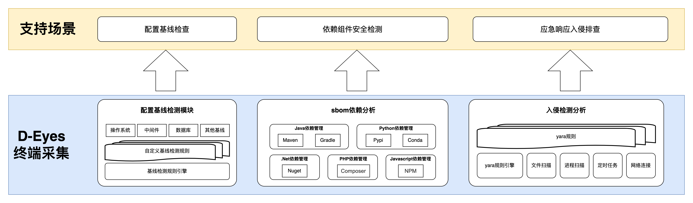

# D-Eyes 工具简介

D-Eyes 为 M-SEC 社区出品的一款终端检测与响应工具，可在如下方面开展支撑：

1. [x] 作为应急响应工具，支持勒索挖矿病毒及 webshell 等恶意样本排查检测，辅助安全工程师应急响应时排查入侵痕迹，定位恶意样本。
2. [x] 作为软件供应链安全检查或 DevSecOps 工具，可提取 web 应用程序开源组件清单（sbom），配合 SCA（如 RyzeSCA），判别引入的组件风险。
3. [ ] 作为基线检查工具，辅助检测和排查操作系统配置缺陷；(TODO)
4. [ ] 作为资产探测工具，以本机为中心探测可达目标资产。
   

D-Eyes 通过相应的一级指令，支持应急响应、SCA 以及基线检查等场景，更多功能，期待您的建议，社区将评估和纳入发布计划中。

- detect 指令：支持应急响应场景，支持 windows 和 linux 系统的入侵排查；
- sbom 指令：支持 Java、Python、PHP、.Net、NodeJS 等应用的 sbom 分析；
- benchmark 指令：支持 windows 和 linux 操作系统、常用中间件及数据库的配置缺陷检查，排查隐患。
- assets指令：支持给定探测资产目标，或者自动探测和发现周边主机资产及互联网连通性。
## 工具运行

为保证检测覆盖范围和效果，建议使用高权限用户启动。

- Windows 操作系统：建议以管理员身份运行 cmd，之后再输入 D-Eyes 路径运行即可或进入终端后切换到 D-Eyes 程序目录下运行程序。
- Linux 操作系统：建议以 root 用户身份运行 D-Eyes 工具；

## 应急响应-detect

### D-Eyes 应急响应操作命令

#### 异常文件排查

> 若扫到恶意文件，会在 D-Eyes 所在目录下自动生成扫描结果 D-Eyes.xlsx 文件，若未检测到恶意文件则不会生成文件，会在终端进行提示。

1. 默认扫描(默认以 50 个线程扫描脚本当前执行目录)  
   命令：`D-Eyes de fs`
2. 指定路径扫描(-P 参数)  
   单一路径扫描：
   windows：`D-Eyes de fs -p D:\tmp`
   linux：`./D-Eyes de fs -p /tmp`
   多个路径扫描：
   windows：`D-Eyes de fs -p C:\Windows\TEMP,D:\tmp,D:\tools`
   linux：`./D-Eyes de fs -p /tmp,/var`
3. 指定线程扫描(-t 参数)  
   windows：`D-Eyes de fs -p C:\Windows\TEMP,D:\tmp -t 3`
   linux：`./D-Eyes de fs -p /tmp,/var -t 3`
4. 指定单一 yara 规则扫描(-r 参数)  
   windows：`D-Eyes de fs -p D:\tmp -t 3 -r ./Botnet.Festi.yar`
   linux：`./D-Eyes de fs -p /tmp -t 3 -r ./Botnet.Festi.yar`

#### 主机信息获取

获取主机的相关信息，包括系统版本、内核版本以及当前用户等信息。
操作命令：`D-Eyes de host`

#### 异常外联进程排查

提取进程外联 IP 信息，可联动威胁情报平台排查如挖矿/勒索病毒以及异常外联等行为。
操作命令：`D-Eyes de netstat`
> 主机若存在远程连接，执行该条命令后会在工具同级目录下自动生成“RemoteConnectionIP.csv”文件，之后可直接将该文件上传到“绿盟
> NTI 威胁研判模块”查询主机所有远程连接 IP 信息。
> 绿盟 NTI 威胁研判模块网址：https://ti.nsfocus.com/advance/#/judge

#### 排查异常主机账户

列出当前主机的所有账户，用于排查异常账户，如隐藏账户。
操作命令：`D-Eyes de user`

#### CPU 使用率异常进程排查

提取前 15 个 CPU 使用率高的进程，排查当前时间 CPU 占用率异常的进程。
操作命令：`D-Eyes de top`

#### 计划任务异常排查

辅助排查异常计划任务，判断是否有异常后门
操作命令：`D-Eyes de task`

#### 异常自启项排查

辅助排查异常自启项，判断是否有异常后门
操作命令：`D-Eyes de autorun`

#### 导出主机基本信息

以上操作命令用于精细化定点排查，D-Eyes 也支持 export 命令导出所有相关信息，辅助应急响应人员排查。
操作命令：`D-Eyes de export`
> 执行该条命令后会在工具同级目录下自动生成“SummaryBaseInfo.txt”文件，文件内容包括主机系统信息、主机用户列表、主机计划任务及主机
> IP 信息。

### Linux 主机自检

Linux 命令： `./D-Eyes de check`
> 目前 Linux 自检功能支持以下模块检测：
> 空密码账户检测、SSH Server wrapper 检测、SSH 用户免密证书登录检测、主机 Sudoer 检测、alias 检测、Setuid 检测、SSH 登录爆破检测、主机
> Rootkit 检测、主机历史命令检测、主机最近成功登录信息显示、主机计划任务内容检测、环境变量检测、系统启动服务检测、TCP Wrappers
> 检测、inetd 配置文件检测、xinetd 配置文件检测、预加载配置文件检测。

## sbom(生成物料清单)

D-Eyes 支持环境变量检测和文件检测两种模式，解析包管理工具的相应内容，生成检测对象的 sbom 文件，助力安全左移和软件供应链安全管理相关工作。

### 根据环境变量提取 sbom

Python 开发运行环境中，可以通过包管理工具创建多套 Python 环境，并对依赖包进行管理，针对 Python 语言，支持 pip 和 conda
的环境变量提取 sbom。
pip 环境变量依赖检测 `./D-Eyes sbom pip`
conda 环境变量依赖检测 `./D-Eyes sbom conda`

### 配置文件解析

D-Eyes Sbom 模块根据文件名称和文件后缀自动识别属于哪一种语言，哪一种解析类型的文件，解析生成相应的 sbom。

#### D-Eyes支持语言清单

D-Eyes 支持如下语言及包管理器的相关配置文件解析：

|   支持语言   |  包管理器   | 解析文件               |
|:--------:|:-------:|:-------------------|
|  `Java`  | `Maven` | `pom.xml`          |
| `Python` |  `Pip`  | `requirements.txt` |

#### sbom提取操作命令

__检测指定的目录__
`./D-Eyes sbom -p D:\test\mall4cloud-master`

__检测指定的文件__
`./D-Eyes sbom -p D:\test\requirements.txt`
`./D-Eyes sbom -p D:\test\pom.xml`

__sbom检测结果输出__

生成 json 类型的 sbom 物料清单
`./D-Eyes sbom -p D:\test\mall4cloud-master --type json`

生成 xml 类型的 sbom 物料清单
`./D-Eyes sbom -p D:\test\mall4cloud-master --type xml`

将sbom结果输出至指定路径
`./D-Eyes sbom -p D:\test\mall4cloud-master --type xml --out D:\test`

## 安全开发者支持

亲爱的开发者，白帽子朋友们，
d-eyes 是一款支持应急响应、软件成分分析（SCA）以及基线检查等场景检测的开源工具。自从项目启动以来，我们一直致力于为广大用户提供一个强大、灵活且高效的安全检测平台。
然而，d-eyes 的成长离不开社区的支持和贡献。我们诚挚地邀请更多的开发者加入到 d-eyes 的开发中来，不论是修改现有的
bug，还是提交新的应急响应检测插件。您的每一份贡献，都会让 d-eyes 变得更加完善和强大。
我们希望，通过大家的共同努力，d-eyes 能够支持更多种类的应急响应检测，并且在检测的准确性和覆盖面上不断提升。让我们一起携手，共同打造一个更加安全、可靠的开源工具，造福更多的开发者和用户。
真诚期待您的参与和贡献！

如果您是攻防或者开发爱好者，您可以挑战和使用D-Eyes的更高级自定义能力，也欢迎您积极给予社区贡献插件或规则；

- D-Eyes工具源码完全开放，您可以审计源码发现漏洞或隐藏后门，欢迎提交给[M-SEC社区](https://msec.nsfocus.com/)。
- 如官方发布的二进制程序不支持您的系统，您可以下载源码代码，参照[编译指南](./docs/编译指南.md)
  自行编译使用，或者提供操作系统环境给M-SEC社区，由M-SEC社区编译打包提供给您。
-
D-Eyes应急响应detect支持插件化，您也可以编写新的的检测插件提交给M-SEC社区获得积分奖励，插件编写规范请参考[应急响应‐插件编写](./docs/应急响应-插件编写.md)。
- 您也可以申请成为开发者，共同参与M-SEC社区工具建设，守护网络安全，M-SEC社区将为您授予专属称号。

---

## 注意事项

> 在 D-Eyes 工具目录下子目录 yaraRules 中，部分规则会触发杀毒软件告警，因为该目录存放的规则文件与杀软查杀规则相符，会触发杀软告警，直接加白即可，不会存在实际危害。

## 附录：目前支持的检测规则

目前支持的恶意样本检测种类如下：

### 勒索：

Babuk、BadEncript、BadRabbit、BCrypt、BlackMatter、Cerber、Chaos、ChupaCabra、Common、Conti、Cryakl、CryptoLocker、cryt0y、DarkSide、Fonix、GandCrab、Globeimposter、Henry217、HiddenTear、LockBit、Locky、Magniber、Makop、MBRLocker、MedusaLocker、Nemty、NoCry、Petya、Phobos、Povlsomware、QNAPCrypt、Sarbloh、Satana、ScreenLocker、Sodinokibi、Stop、Termite、TeslaCrypt、Thanos、Tohnichi、TrumpLocker、Venus、VoidCrypt、Wannacrypt、WannaDie、WannaRen、Zeppelin

### 挖矿：

Wannamine、ELFcoinminer、givemexyz 家族、Monero、TrojanCoinMiner

### 僵尸网络：

BlackMoon、Festi、Gafgyt、Kelihos、Mykings

### Webshell及蓝军武器：

支持中国菜刀、Cknife、Weevely、蚁剑 antSword、冰蝎 Behinder、哥斯拉 Godzilla 等常见工具的 webshell 脚本的检测。