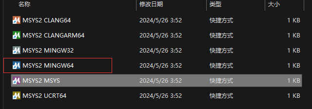

<div align=center>
<h2>编译指南</h2>
</div>

# d-eyes windows编译
## 先决条件

1. MSYS2：您可以从官方网站下载 MSYS2
   安装程序并按照那里提供的安装说明进行操作，[https://www.msys2.org/](https://www.msys2.org/)。（安装的时候会卡在%50比较久，正常情况不用担心）
2. Go：确保您的机器上安装了 Go（Golang）。您可以从官方网站下载最新版本的 Go，[https://go.dev/](https://go.dev/)。

## 编译步骤

打开MSYS2 MinGW 64-bit (注意打开软件的图标),执行以下命令



更新 MSYS2包

```shell
pacman -Suy

```
下载需要的包

```shell
pacman -S mingw-w64-x86_64-toolchain mingw-w64-x86_64-gcc mingw-w64-x86_64-make mingw-w64-x86_64-pkg-config base-devel openssl-devel autoconf-wrapper automake libtool
```

下载yara源码编译 [https://github.com/VirusTotal/yara/releases](https://github.com/VirusTotal/yara/releases)

进入到解压后的目录执行

```shell
./bootstrap.sh
./configure
make
make install
```

执行失败的时候需要删除上次make遗留的文件

```shell
make clean #清除上一次make命令生成的文件
make distclean #清除上一次make以及configure命令生成的文件
```

把 安装位置:\msys2\mingw64\bin 添加到环境变量中

修改go环境变量配置

```shell
go env -w CGO_ENABLED = 1
go env -w GOARCH = amd64
```
编写测试程序

```Go
package main

import (
	"fmt"
	"github.com/hillu/go-yara/v4"
)

func main() {
	c, err := yara.NewCompiler()
	if c == nil || err != nil {
		fmt.Println("Error to create compiler:", err)
		return
	}
	rule := `rule test {
    meta: 
     author = "Aviad Levy"
    strings:
     $str = "abc"
    condition:
     $str
   }`
	if err = c.AddString(rule, ""); err != nil {
		fmt.Println("Error adding YARA rule:", err)
		return
	}
	r, err := c.GetRules()
	if err != nil {
		fmt.Println("Error getting YARA rule:", err)
		return
	}
	var m yara.MatchRules
	err = r.ScanMem([]byte(" abc "), 0, 0, &m)
	if err != nil {
		fmt.Println("Error matching YARA rule:", err)
		return
	}
	fmt.Printf("Matches: %+v", m)
}

```

运行程序

```shell
go run -ldflags "-extldflags=-static" -tags yara_static main.go
```

打包程序

```shell
go build -ldflags "-extldflags=-static" -tags yara_static main.go
```

<div align=center>
如果在运行和打包程序时都没有出现问题，这意味着当前的编译环境是没有问题的。您可以在自己的电脑上手动编译 d-eyes 工具。
</div>