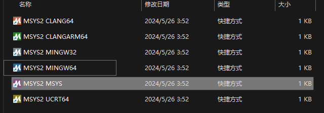

# 编译指南

<div align=center>
<h2>编译指南</h2>
</div>

# 通用：YARA 后端与诊断

- **后端切换**：Agent 通过环境变量 `D_EYES_YARA_BACKEND` 控制 `auto|native|portable` 模式，默认为 `auto`。便携模式（pure Go）无需 CGO；native 模式需要可用的 libyara，并在构建/测试命令中添加 `-tags yara_native`。
- **快速诊断**：执行 `d-eyes detect diag --backend auto` 可打印当前后端、规则版本、覆盖率与关键家族缺失情况。CI 失败时建议第一时间运行该命令以确认配置。
- **CI 测试矩阵**：推荐直接执行 `scripts/test-matrix.sh`，其中 Agent 部分会先跑 portable（`CGO_ENABLED=0`）路径，并在检测到 libyara（`pkg-config --exists yara`）时自动追加 `-tags yara_native` 测试。示例：
  ```bash
  scripts/test-matrix.sh
  ```

# 通用：`detect memscan` 与平台支持

- **平台范围**：阶段一 `d-eyes detect memscan` 仅提供 **Windows** 原生实现（基于 `VirtualQueryEx + ReadProcessMemory`）；非 Windows 平台会明确提示“不支持/已降级”。
- **默认策略**：`memscan` 为显式触发能力（不默认集成到 `respond/audit/inventory/baseline/bas` 链路），必须二选一指定扫描范围：`--pid <pid>` 或 `--all`。
- **安全默认值**：默认只扫 RWX commit 区域（`--rwx-only=true`），并启用限额（`--max-bytes/--max-regions/--timeout`）。证据保全（`--evidence` / `--minidump`）默认关闭，需显式启用。

# 通用：威胁情报（ThreatIntel）退化口径

- **模式**：CLI 全局参数 `--ti-mode`（或 `D_EYES_TI_MODE`）支持 `auto/local/hybrid/server`。
- **hybrid 退化**：当未配置 API Key、触发限额（HTTP `429`）或 Provider 暂不可用时，Agent 会自动**退化为 local**，并在元数据中输出稳定字段用于 CI/排障：`threatintel.mode_effective`、`threatintel.remote_enabled`、`threatintel.notice`（code）与 `threatintel.notice_detail`（短摘要，已脱敏/截断）。
- **server 分工**：`ti-mode=server` 下 Agent **不直连** OpenTIP/MetaDefender，仅上传 artifacts/token（`threatintel.artifact_tokens`）交由 Server orchestrator 执行外部扫描与 TTL 管理。

# d-eyes windows编译
## 先决条件

1. MSYS2：您可以从官方网站下载 MSYS2
   安装程序并按照那里提供的安装说明进行操作，[https://www.msys2.org/](https://www.msys2.org/)。（安装的时候会卡在%50比较久，正常情况不用担心）
2. Go：确保您的机器上安装了 Go（Golang）。您可以从官方网站下载最新版本的 Go，[https://go.dev/](https://go.dev/)。

## 编译步骤

打开MSYS2 MinGW 64-bit (注意打开软件的图标),执行以下命令



更新 MSYS2包

```shell
pacman -Suy

```
下载需要的包

```shell
pacman -S mingw-w64-x86_64-toolchain mingw-w64-x86_64-gcc mingw-w64-x86_64-file mingw-w64-x86_64-make mingw-w64-x86_64-pkg-config base-devel openssl-devel autoconf-wrapper automake libtool
```

下载yara源码编译 [https://github.com/VirusTotal/yara/releases](https://github.com/VirusTotal/yara/releases)

进入到解压后的目录执行

```shell
./bootstrap.sh
./configure --enable-magic --with-crypto --disable-shared
make
make install
```

执行失败的时候需要删除上次make遗留的文件

```shell
make clean #清除上一次make命令生成的文件
make distclean #清除上一次make以及configure命令生成的文件
```

把 安装位置:\msys2\mingw64\bin 添加到环境变量中

修改go环境变量配置

```shell
go env -w CGO_ENABLED = 1
go env -w GOARCH = amd64
```
编写测试程序

```Go
package main

import (
	"fmt"
	"github.com/hillu/go-yara/v4"
)

func main() {
	c, err := yara.NewCompiler()
	if c == nil || err != nil {
		fmt.Println("Error to create compiler:", err)
		return
	}
	rule := `rule test {
    meta: 
     author = "Aviad Levy"
    strings:
     $str = "abc"
    condition:
     $str
   }`
	if err = c.AddString(rule, ""); err != nil {
		fmt.Println("Error adding YARA rule:", err)
		return
	}
	r, err := c.GetRules()
	if err != nil {
		fmt.Println("Error getting YARA rule:", err)
		return
	}
	var m yara.MatchRules
	err = r.ScanMem([]byte(" abc "), 0, 0, &m)
	if err != nil {
		fmt.Println("Error matching YARA rule:", err)
		return
	}
	fmt.Printf("Matches: %+v", m)
}

```

运行程序（native 模式构建示例，需要提前通过 MSYS2 安装 libyara 并确保 `pkg-config --libs yara` 可用）

```shell
CGO_ENABLED=1 go run -ldflags "-extldflags=-static" -tags "yara_static yara_native" main.go
```

打包程序

```shell
CGO_ENABLED=1 go build -ldflags "-extldflags=-static" -tags "yara_static yara_native" main.go
```

# d-eyes linux版本编译
## 编译步骤   
推荐在alpine环境中进行编译  
```shell
docker run --rm -it -v $(pwd):/root/d-eyes golang:1.22.5-alpine3.20 /bin/sh
```
进入到容器中执行以下命令   
```shell
# 如有需要，应当设置GOPROXY和apk源
cd /root/d-eyes
go mod tidy
apk update && apk add  yara-dev libmagic-static openssl-libs-static build-base
```
编译命令  
```
# 便携模式（默认，CGO 可为 0）
CGO_ENABLED=0 go build ./cmd/agent

# native 模式
CGO_ENABLED=1 go build -tags yara_native -ldflags '-linkmode external -extldflags "-static -lmagic -lws2_32"' ./cmd/agent
```

> 提示：若需在 Linux CI 上验证 native 模式，请安装 `yara-dev`（或同等包）、确保 `pkg-config --libs yara` 工作正常，然后运行 `scripts/test-matrix.sh`（会自动启用 `-tags yara_native`），或手动执行 `cd agent && CGO_ENABLED=1 go test -tags yara_native ./...`。

## .yarac 缓存（可选）
如需在离线/大规模环境中加速规则加载，可自行使用 `yarac` 将 `agent/yaraRules/*.yar` 编译为 `.yarac` 并随制品分发。本仓库当前未内置默认的 `.yarac` 生成脚本。

## CI/CD 建议
1. 运行 `scripts/test-matrix.sh`，确保 Agent/Server 关键路径测试通过（Agent 会覆盖 portable 路径，并在依赖满足时覆盖 `yara_native`）。
2. Windows Job 增加 `detect memscan` 的 e2e（`scripts/test-matrix.sh` 已内置示例用例），并设置 `go test -timeout` 上限避免 hang。
3. 将 `d-eyes detect diag --backend auto --json` 的输出保存到 CI 日志，方便快速定位规则覆盖率/缺失家族/回退原因等问题。
