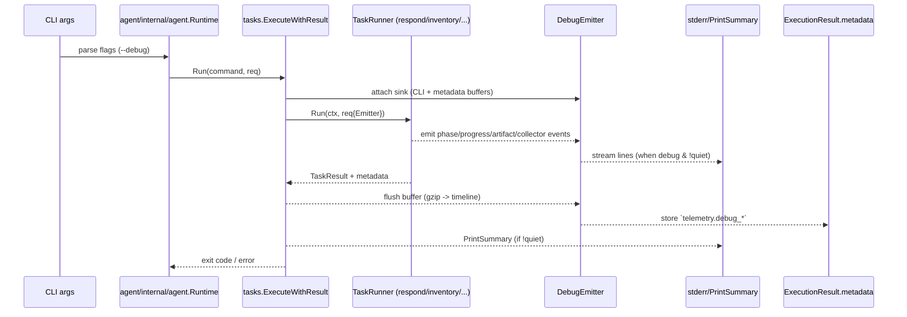

# 0.2 Logging & telemetry sink audit

## Existing sinks
### CLI stdout / log files
- `tasks.Execute` always prints via `reporting.Manager.PrintSummary` unless `req.Quiet` is true; JSON output is emitted first when `--json` is enabled (`agent/internal/tasks/execute.go:51-88`).
- `reporting.Manager.PrintSummary` writes a one-shot banner + report list + risks/notes to stdout with ANSI colors (`agent/pkg/reporting/manager.go:42-99`). There is no incremental progress API and it assumes TTY output.
- `agent/internal/agent/runtime.go:69-91` prints the closing "Thank you" message when quiet mode is off.
- `pkg/logs.InitLog` redirects the standard logger to `d-eyes.logs` adjacent to the binary (`agent/pkg/logs/log.go:8-30`). This sink is file-only and disconnected from CLI output.
- Many runners (inventory/assets/baseline) instantiate `progress.NewManager(progress.NullReporter{}, ...)`, so there is no live stdout stream even though the progress package already supports console output when provided with a `progress.NewConsoleReporter` (`agent/internal/tasks/inventory.go:122`, `agent/internal/benchmarkexec/runner.go:62`, `agent/internal/assets/runner.go:100-152`).

### Metadata / remote pipeline
- Every runner populates `TaskResult.Metadata`; `tasks.ExecuteWithResult` injects telemetry via `telemetry.NewTaskResourceTracker` and `AppendTaskResourceMetadata` before returning (`agent/internal/tasks/execute.go:36-46`).
- `tasks.ToExecutionResult` clones `TaskResult.Metadata`, copies summary info, and sets `ReportedAt`. Remote mode calls this result and uploads it through `serverpb.ReportResultRequest`, so any structured debug payload must fit inside `map[string]string` (`agent/internal/tasks/execute.go:120-175`, `agent/internal/agent/daemon.go:797-904`).
- `telemetry.CollectExecutionMetadata` currently returns nil unless a collector overrides it; remote runner merges its response into `execModel.Metadata`, but CLI runs never call `CollectExecutionMetadata` directly (`agent/internal/telemetry/telemetry.go:118-175`, `agent/internal/agent/daemon.go:830`).
- Remote automation (`dispatchAutoRespond`) and CLI commands ultimately share the same runner APIs, so a single debug event buffer can feed both local output and remote metadata if we wire it before `tasks.Execute` returns (`agent/internal/agent/daemon.go:421-490`).

### ETW/eBPF collector streaming
- `collect` CLI builds a `collector.Service` which manages long-running ETW/eBPF collectors (`agent/internal/agent/collect_command.go:16-190`).
- Each `collector.Manager` registers factories, starts collectors asynchronously, and exposes `CollectorStatus` snapshots (name/kind/state/last error) (`agent/internal/collector/manager.go:11-111`).
- Output routing happens via `buildOutputHandler`: depending on config it writes JSONL to stdout, to a file, or to a stream HTTP target (`agent/internal/collector/output.go:8-71`). There is currently no concept of debug progress; the CLI only prints a startup summary and the raw event JSON stream.
- Detection automation uses `collector.EventHandler` hooks, so we can reuse the same interception layer to emit debug lifecycle events without duplicating ETW payloads (`agent/internal/collector/service.go:7-120`).

## Extension points for debug mode
### CLI + metadata unification
1. **Debug event buffer**
   - Introduce a `DebugEmitter` (buffer + fan-out) that runners can write to via helper functions (e.g., `DebugPhaseStart`, `DebugProgress`, `DebugNotice`).
   - Attach this emitter to `TaskRequest` before invoking the runner, so modules like `inventory`, `baseline`, `respond`, etc. can opt-in without changing function signatures across the stack.
   - Maintain a bounded ring (e.g., 200 events) with timestamp, phase, message, optional progress ratio. This prevents unbounded metadata size.

2. **CLI sink**
   - When `--debug` is enabled and the session is not quiet, stream events immediately to stderr using a lightweight formatter (timestamp + phase + message). This sink replaces the need to couple each runner with `fmt.Println`. `reporting.Manager.PrintSummary` continues to print at the end, so the debug stream must not interfere with its colorized output—writing to stderr avoids ANSI collisions.
   - For non-interactive terminals we reuse the same formatting but skip cursor control; the sink just prints log-style lines.

3. **Metadata sink**
   - Before returning from `tasks.ExecuteWithResult`, encode the event buffer as compressed JSON (reuse `telemetry.encodePayload`). Store it under a deterministic key such as `telemetry.debug_timeline`. Keep aggregate stats (first/last timestamps, failed phases) in separate keys to allow server-side filtering without decoding.
   - Remote runner already copies `TaskResult.Metadata`, so these keys automatically flow to `ExecutionResult.metadata` and into `serverpb.ReportResultRequest.Metadata`.

4. **Event taxonomy (shared across CLI & metadata)**
   - **Phase lifecycle**: `phase.start`, `phase.end` with `phase_id`, `label`, `target` (e.g., respond module, baseline stage, inventory target). Emitted whenever runners enter/leave a logical block.
   - **Progress**: `progress.update` capturing `current`, `total`, and optional `unit` (IPs, hosts, steps). Inventory/baseline can wire `progress.Manager` to send these.
   - **Artifact**: `artifact.ready` for outputs produced (path/label). Helps correlate CLI prints with metadata.
   - **Warning/Error**: `notice` for non-fatal issues; `error` for failures. Already tracked in `TaskResult.Notes`, but including them in the timeline ensures chronological context.
   - **Collector**: `collector.event` for ETW/eBPF lifecycle (see below).

### Reporting / PrintSummary integration
- Keep `PrintSummary` untouched for backwards compatibility, but have the debug emitter register a `flush` callback that prints a concise "Debug timeline saved to metadata" message when CLI is not quiet. This acknowledges persistence without duplicating details already shown during streaming.
- When `--json` is supplied together with `--debug`, we still stream events to stderr but skip the human summary by automatically enabling `--quiet` semantics (the user explicitly asked for machine-readable stdout). Document this behavior in CLI help.

### ExecutionResult metadata decisions
- `telemetry.debug_timeline`: gzip+base64 encoded JSON array of debug events produced during the run.
- `telemetry.debug.summary`: short JSON object containing counts per event type, earliest/latest timestamps, and the ID of the last phase. Server UI can parse this key for quick previews.
- `telemetry.debug.error_phase`: optional string recording which phase emitted the first error event (if any), simplifying alert routing.
- Because metadata is a map of strings, we keep payload sizes under ~32 KB per task by capping events and compressing them.

### Collector.Service alignment
- Wrap `collector.EventHandler` with a `debugCollectorInterceptor` that emits lifecycle events whenever collectors start, stop, or hit errors. This interceptor feeds the same debug emitter used by runners so the events surface in CLI (during `d-eyes collect --debug`) and in remote metadata if `collect` ever reports results.
- Extend `collector.Manager` to accept an optional `DebugEmitter` pointer. When set, it pushes `collector.state` events whenever `CollectorStatus` changes (started/running/stopped/error). This is preferable to polling because it captures transient failures.
- For streaming ETW/eBPF payloads we **do not** duplicate the raw events; instead, debug mode can emit aggregate counts (events per minute, bytes written) via `collector.stats` events emitted on an interval.
- CLI output: besides forwarding the JSON stream, debug mode prints structured lines such as `[collect][collector=etw-winapi] started providers=X` or `[collect][stream] uploaded batch size=256`. All of them reuse the common emitter to stay consistent.

## Decision summary
1. Centralize debug events through a reusable emitter attached to `TaskRequest` so both CLI and remote paths share instrumentation.
2. Stream debug events to stderr when `--debug` is enabled, leaving `reporting.Manager.PrintSummary` unchanged but announcing where the timeline is stored.
3. Encode the event buffer into `ExecutionResult.metadata` using keys `telemetry.debug_timeline`, `telemetry.debug.summary`, and `telemetry.debug.error_phase` to keep server-side tooling consistent.
4. Extend `collector.Service`/`collector.Manager` with a debug interceptor that emits collector lifecycle and stats events instead of duplicating ETW data, guaranteeing consistent behaviour across local CLI runs, remote tasks, and continuous collectors.

## Runner instrumentation checklist
| Runner | Stage / progress events | Primary functions to touch |
|--------|------------------------|----------------------------|
| `respond` | `phase.start/end` per module (`HostSummary`, `FileScan`, `NetworkConnections`, etc.); `notice` when a module errors; `artifact.ready` when module results are appended. Progress is count of completed modules vs total. | `agent/internal/tasks/respond.go` (loop over `respondModule`), module helpers under `agent/internal/tasks/respond_*.go` for artifact notifications. |
| `inventory` | `phase.start` per target, `progress.update` for host discovery (hosts found vs expected), port scan batches (ports processed vs total), service detection toggles; `notice` for cache hits/misses. Aggregated `artifact.ready` when per-target JSON saved. | `agent/internal/tasks/inventory.go` (target loop, cache branch), `agent/internal/tasks/inventory_writer.go` (summary output), `agent/internal/assets/scanner.go` & `agent/internal/assets/runner.go` to bridge `progress.Manager` callbacks into debug events. |
| `baseline` | High-level phases: `phase.start` for config load, checker registration, per-scope scan; `progress.update` for `StageBenchmark` (checks loaded) and `StageBenchmarkChecks` (checks executed); `notice` for warnings from config manager; `artifact.ready` when final report saved. | `agent/internal/tasks/baseline.go`, `agent/internal/benchmarkexec/runner.go`, plus `agent/internal/benchmark/scanner.go` to emit progress events via the shared emitter. |
| `collect` | `collector.state` for each collector start/stop/error; `collector.stats` at intervals (events/sec, batches flushed); `notice` when filters/overrides applied; `progress.update` for stream batches uploaded. Also `artifact.ready` when file output writer rotates. | `agent/internal/agent/collect_command.go` (CLI overrides, service start), `agent/internal/collector/service.go` (decorated handlers), `agent/internal/collector/manager.go` (state transitions), `agent/internal/collector/output.go` (file writer). |

### collector.Manager hooks
- Add optional `DebugEmitter` field to `collector.Manager`. When present, invoke it inside `Start`, `Stop`, and `StopAll` to emit `collector.state` events with `name`, `kind`, and `state` (e.g., `starting`, `running`, `stopped`).
- Enhance `managedCollector` goroutine to capture start errors and push `collector.error` debug events before returning.
- Extend `CollectorStatus` snapshots within `Service.Status()` to broadcast periodic `collector.stats` events when debug is enabled (sample interval ~2s) without leaking stream payloads.

### Respond/Inventory/Baseline instrumentation targets
- `respond`: Wrap the module iteration with helper functions `emitModuleStart/emitModuleEnd` so each module announces progress. Failure paths should emit `debugEmitter.Error` before continuing. Modules that create outputs should call `DebugArtifact` with generated file paths.
- `inventory`: Inject the emitter into `defaultInventoryExecutor.ScanTarget` and bridge `progress.Manager` by providing a reporter adapter that forwards `Stage`/`Update` calls to debug events. Cache restores should emit `notice` events with `metadata.cache_hit=true`.
- `baseline`: Provide a custom `progress.Reporter` implementation that fans out to both console (existing NullReporter or future debug console) and the emitter. When `benchmarkexec.Execute` registers checkers, annotate each scope as a phase so CLI users can see time spent per category.
- `collect`: Decorate `collector.EventHandler` with a proxy that emits `collector.event` debug entries (`event_type`, `sequence`, optional sample payload count) without logging raw ETW data.

## Sequence diagram (planned data flow)

## Pending code changes for implementation stage
1. `agent/internal/tasks/execute.go`: create and manage `DebugEmitter`, wire CLI stderr sink, encode metadata (`telemetry.debug_*`).
2. `agent/internal/app.go`: expose `--debug`/`DEYES_DEBUG`, plumb flag into `TaskRequest.Metadata` or context for remote parity.
3. Runners:
   - `agent/internal/tasks/respond.go` & module helpers.
   - `agent/internal/tasks/inventory.go` + `agent/internal/assets/*` progress integration.
   - `agent/internal/tasks/baseline.go` + `agent/internal/benchmarkexec/runner.go`.
   - `agent/internal/agent/collect_command.go`, `agent/internal/collector/service.go`, `agent/internal/collector/manager.go`, `agent/internal/collector/output.go`.
4. Shared utilities: new `internal/debug` (or `agent/pkg/debugger`) package for emitter/encoder; reporting adapter for `progress.Manager` bridging.
5. Remote runner (`agent/internal/agent/daemon.go`) ensures debug metadata propagates when remote tasks set `debug` flag.

## Runner-specific implementation plan & test strategy
| Order | Target | Sub-tasks | Testing focus |
|-------|--------|-----------|---------------|
| 1 | Shared plumbing | Build `DebugEmitter` package; extend `TaskRequest` to carry emitter references; add CLI flag parsing + stderr sink. | Unit tests for emitter buffer limits, encoding, CLI flag parsing regression tests, golden tests for metadata keys. |
| 2 | `respond` | Instrument module loop: emit `phase.start/end`, per-module progress, artifact notices. Provide minimal fake modules for unit tests. | Update `agent/internal/tasks/respond_test.go` to assert debug metadata entries; add CLI integration test using `cli_test_helper` verifying stderr lines when `--debug` set. |
| 3 | `inventory` | Adapt `progress.Manager` to call emitter, wrap `defaultInventoryExecutor` stages, capture cache hits/misses. | Extend `agent/internal/tasks/inventory_runner_test.go` with debug assertions; integration test covering multi-target run ensures metadata timeline capped. |
| 4 | `baseline` | Bridge benchmark progress callbacks to emitter; tag config warnings and summary artifact events. | Add tests in `agent/internal/tasks/baseline_runner_test.go` and `agent/internal/benchmarkexec` to ensure event count matches check count; CLI smoke test ensures summary still prints. |
| 5 | `collect` | Add `DebugEmitter` hooks to `collector.Service`, `collector.Manager`, render CLI lines for lifecycle/stats. Ensure no duplication of raw ETW data. | Unit tests for `collector.Manager` new hooks, verifying events on start/stop/error; CLI E2E test with stub collector verifying debug lines & metadata. |
| 6 | Remote propagation | Ensure `daemon` passes debug flag from server payload, includes metadata in `ReportResultRequest`. | Extend `agent/internal/agent/daemon_runtime_test.go` to simulate debug runs, verifying metadata keys forwarded and quiet mode respected. |

Testing order mirrors implementation order so each step gains regression coverage before touching next runner. After all steps, add umbrella integration script covering `respond`, `inventory`, `baseline`, `collect` with `--debug` to guard against regressions.
