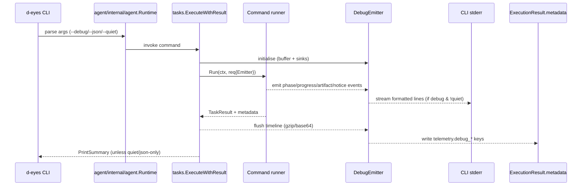

# 0.3 Debug event & progress plan

## Global sequence

All runners share the same taxonomy:
- `phase.start` / `phase.end`: `phase`, `label`, `target`, `sequence`.
- `progress.update`: `phase`, `current`, `total`, `unit`, `detail`.
- `artifact.ready`: `path`, `label`, `size`.
- `notice`: `scope`, `message`, `severity`.
- `error`: `scope`, `message`, `errno`.
- `collector.state` / `collector.stats`: `name`, `kind`, `state`, `rate` (collect only).

## Per-command timelines

### respond
| Stage | Events | Instrumentation |
|-------|--------|-----------------|
| Module scheduling | `phase.start` (module list), `progress.update` (0/n modules) | `agent/internal/tasks/respond.go` before module loop |
| Module execution | `phase.start` per module, `progress.update` after module completes, `notice` on module error | Wrap `module.Run` calls |
| Artifact write | `artifact.ready` for module outputs | When appending to `TaskResult.Outputs` |
| Completion | `phase.end` for overall respond, `notice` summarising failures | After loop |

### audit
| Stage | Events | Instrumentation |
|-------|--------|-----------------|
| Baseline sub-run | `phase.start` baseline, reuse baseline runner events (see below) | `agent/internal/tasks/audit.go` when calling `baselineRunner.Run` |
| Host summary | `phase.start/end`, `artifact.ready` for generated report | `runHostSummary` helper |
| User inspection | `phase.start/end`, `notice` for warnings | `runUserInspection` helper |
| Summary file | `artifact.ready` for audit summary JSON | `writeAuditSummary` |

### inventory
| Stage | Events | Instrumentation |
|-------|--------|-----------------|
| Target loop | `phase.start` per target, `progress.update` (target index / total) | `agent/internal/tasks/inventory.go` target iteration |
| Host discovery | `progress.update` for hosts found, `notice` on errors | Adapt `assets.AssetScanner.DiscoverHosts` via progress reporter bridge |
| Port scan | `progress.update` with `unit=ports`, `detail` IP:port, `phase.end` when done | `AssetScanner.ScanHostPorts` hooking into progress manager |
| Service detect / OS detect | `notice` when toggled, `progress.update` for detection results | `assets/scanner.go` detection blocks |
| Artifact writes | `artifact.ready` for per-target JSON + summary | `defaultInventoryExecutor`, `writeInventorySummary` |
| Cache interactions | `notice` with `metadata.cache_hit=true/false` | `restoreInventoryFromCache`, `cacheInventoryTarget` |

### supplychain
| Stage | Events | Instrumentation |
|-------|--------|-----------------|
| Input validation | `phase.start` supplychain, `notice` for missing inputs | `generateSBOM` / `captureEnvironment` start |
| Manifest scan | `progress.update` per path/file, `notice` on parse errors | `scanProjectManifests`, `scanManifestFile` |
| External tooling | `phase.start` for `pip list`, `error` on command failure | `captureEnvironment` |
| Cache usage | `notice` for manifest cache load/save, `progress.update` for reused vs refreshed counts | `loadManifestCache`, `manifestIdx.Save` |
| Report output | `artifact.ready` for generated SBOM, `notice` for stats | `writeSupplyChainReport` |

### baseline
| Stage | Events | Instrumentation |
|-------|--------|-----------------|
| Config load | `phase.start` baseline, `notice` on config warnings | `baselineRunner.Run` before `benchmarkexec.Execute` |
| Checker registration | `progress.update` (# checkers added), `notice` for unsupported OS | `registerCheckers` |
| Execution | Map `progress.StageBenchmark` and `StageBenchmarkChecks` updates to debug events | `benchmark.Scanner.SetProgress` adapter |
| Threat intel enrichment | `phase.start` TI collector, `artifact.ready` for TI outputs | `collectBaselineThreatIntel` |
| Final report | `artifact.ready` baseline report, `notice` summarizing severity counts | `writeBaselineReport` |

### BAS
| Stage | Events | Instrumentation |
|-------|--------|-----------------|
| Scenario load | `phase.start` BAS, `notice` if scenario resolves from file/ID | `basRunner.Run` before execution |
| Step execution | `phase.start` per step, `progress.update` (# completed steps / total), `notice` for sandbox approvals, `error` on failures | loop over `scenario.Steps` |
| Sandbox transitions | `notice` when sandbox fallback triggered, `collector.state`-style sandbox events for start/stop | `sandboxManagerExecutor.Execute` wrappers |
| Artifact | `artifact.ready` for scenario report, TI outputs | `writeScenarioReport`, TI collector |
| Telemetry summary | `notice` referencing encoded steps/stats | after metadata assembly |

### collect (ETW/eBPF)
| Stage | Events | Instrumentation |
|-------|--------|-----------------|
| CLI filter setup | `phase.start` collect, `notice` for overrides (`--collector`, `--backend`) | `runCollectCommand` |
| Collector lifecycle | `collector.state` for each `Start`/`Stop`, include provider/probe info | `collector.Service.Start` + `collector.Manager` extensions |
| Stream output | `collector.stats` per flush (events/sec, batch size), `notice` on HTTP errors | `collector/output.go`, event uploader hooks |
| Event handler | `notice` summarising event types (without raw payload) at intervals | wrapper around user handler |
| Shutdown | `phase.end` collect, `notice` for running/expected counts | `runCollectCommand` after `waitForCollectorStop` |

## Execution checklist
1. Build shared emitter + CLI plumbing (0.2 plan step 1).
2. Instrument runners in this order: respond → inventory → baseline → supplychain → audit → BAS → collect (collect depends on emitter APIs matured).
3. After each runner instrumentation, add/update tests listed in the 0.2 plan table to validate debug events.
4. For commands that compose others (audit uses baseline), ensure nested events retain parent `phase` references using hierarchical IDs (`audit.baseline.load`, etc.).
